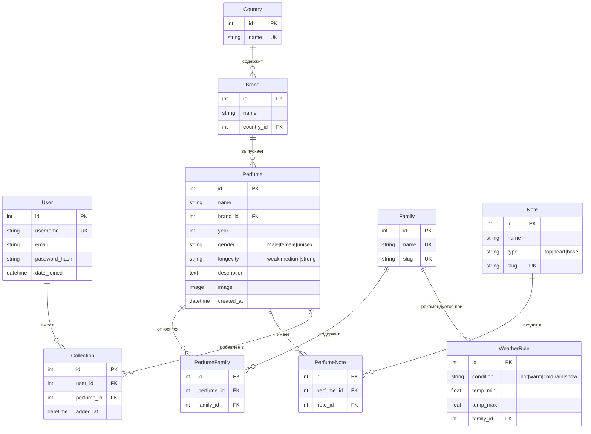

# ER-диаграмма PerfumeWeather

## Описание сущностей

| Сущность | Назначение |
|----------|------------|
| `User` | Пользователь (Django AbstractUser) |
| `Country` | Страна производства бренда |
| `Brand` | Бренд парфюмерии |
| `Family` | Семейство ароматов (восточные, цветочные, цитрусовые и т.д.) |
| `Note` | Нота аромата (роза, ваниль, бергамот) с типом (top/heart/base) |
| `Perfume` | Парфюм — главная сущность |
| `PerfumeFamily` | M:M связь Perfume ↔ Family |
| `PerfumeNote` | M:M связь Perfume ↔ Note |
| `WeatherRule` | Правило: погода → семейство (ядро фичи) |
| `Collection` | Избранные парфюмы пользователя |

## Диаграмма (Mermaid)



## Связи

| Связь | Тип | Назначение |
|-------|-----|------------|
| `Country` → `Brand` | 1:M | Одна страна — много брендов |
| `Brand` → `Perfume` | 1:M | Один бренд — много парфюмов |
| `Perfume` ↔ `Family` | M:M | Парфюм имеет несколько семейств |
| `Perfume` ↔ `Note` | M:M | Парфюм состоит из нескольких нот |
| `User` → `Collection` | 1:M | Юзер имеет избранные парфюмы |
| `Perfume` → `Collection` | 1:M | Парфюм в коллекциях многих юзеров |
| `Family` → `WeatherRule` | 1:M | Одно семейство — несколько правил |

## DBML (для dbdiagram.io)

```dbml
Table users {
  id int [pk, increment]
  username varchar [unique, not null]
  email varchar
  password varchar [not null]
  date_joined datetime
}

Table countries {
  id int [pk, increment]
  name varchar [unique, not null]
}

Table brands {
  id int [pk, increment]
  name varchar [not null]
  country_id int [ref: > countries.id]
}

Table families {
  id int [pk, increment]
  name varchar [unique, not null]
  slug varchar [unique]
}

Table notes {
  id int [pk, increment]
  name varchar [not null]
  type varchar [note: 'top|heart|base']
  slug varchar [unique]
}

Table perfumes {
  id int [pk, increment]
  name varchar [not null]
  brand_id int [ref: > brands.id]
  year int
  gender varchar [note: 'male|female|unisex']
  longevity varchar [note: 'weak|medium|strong']
  description text
  image varchar
  created_at datetime
}

Table perfume_families {
  id int [pk, increment]
  perfume_id int [ref: > perfumes.id]
  family_id int [ref: > families.id]
  indexes {
    (perfume_id, family_id) [unique]
  }
}

Table perfume_notes {
  id int [pk, increment]
  perfume_id int [ref: > perfumes.id]
  note_id int [ref: > notes.id]
  indexes {
    (perfume_id, note_id) [unique]
  }
}

Table weather_rules {
  id int [pk, increment]
  condition varchar [note: 'hot|warm|cold|rain|snow']
  temp_min float
  temp_max float
  family_id int [ref: > families.id]
}

Table collections {
  id int [pk, increment]
  user_id int [ref: > users.id]
  perfume_id int [ref: > perfumes.id]
  added_at datetime
  indexes {
    (user_id, perfume_id) [unique]
  }
}
```

## Логика фичи (для защиты)

1. Юзер вводит **город** на главной
2. Бэк запрашивает **Open-Meteo Geocoding** → широта/долгота
3. Бэк запрашивает **Open-Meteo Forecast** → `temperature_2m`, `weather_code`, `relative_humidity_2m`
4. Маппинг `weather_code` → `condition` (hot/warm/cold/rain/snow)
5. SQL: `WeatherRule WHERE condition = X AND temp_min <= T <= temp_max` → набор `family_id`
6. `Perfume.objects.filter(families__in=families).distinct()` → топ-10
7. Render шаблона с погодой + парфюмы + объяснение почему

## Тестовые правила (для seed)

| Condition | temp_min | temp_max | Family |
|-----------|----------|----------|--------|
| hot | 25 | 50 | Цитрусовые |
| hot | 25 | 50 | Свежие |
| warm | 15 | 25 | Цветочные |
| warm | 15 | 25 | Фруктовые |
| cold | -30 | 10 | Восточные |
| cold | -30 | 10 | Древесные |
| rain | -50 | 50 | Древесные |
| snow | -50 | 5 | Восточные |
